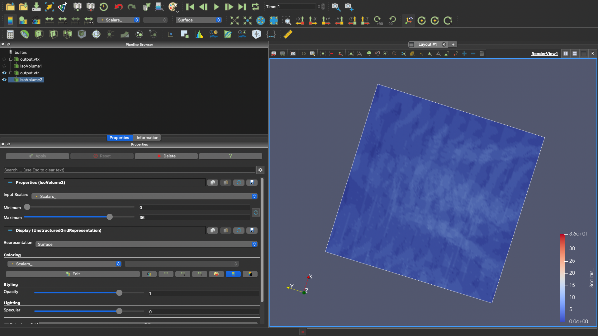
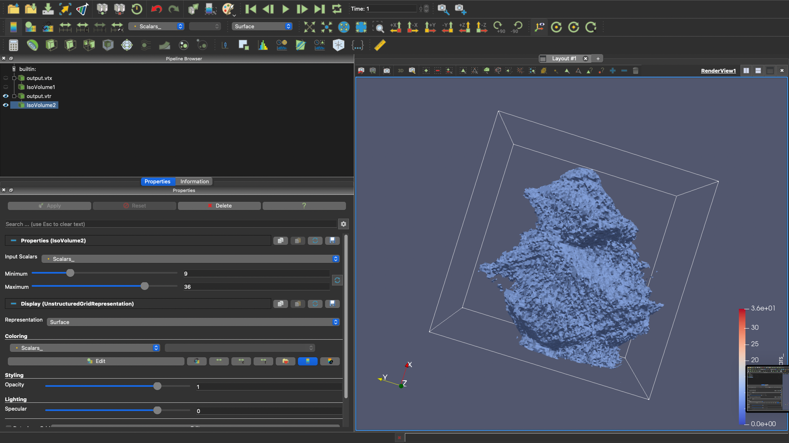
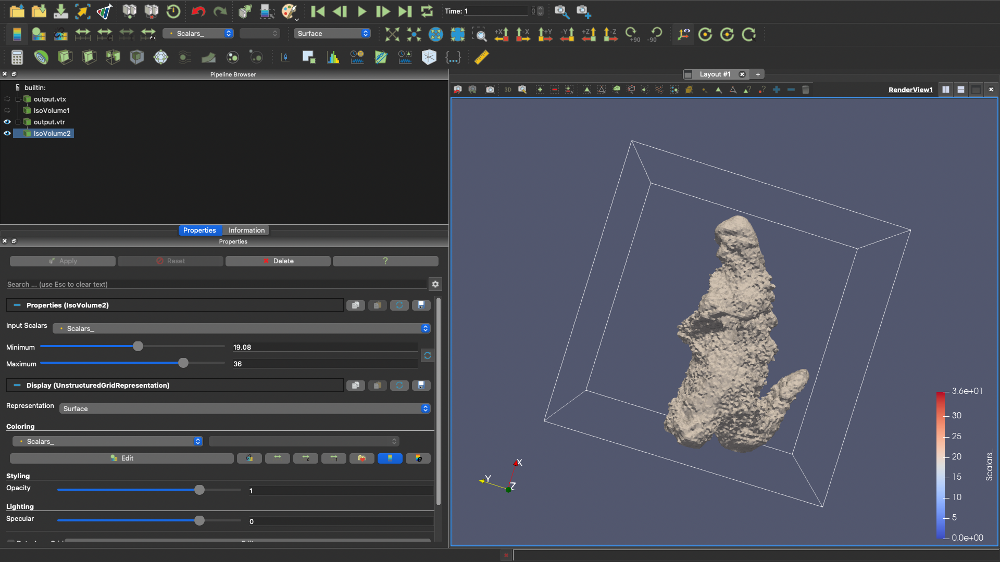
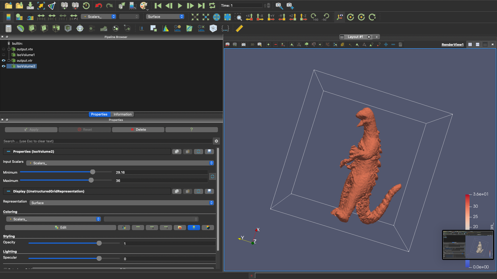

# Voxel-Carving
3-D reconstruction of an object from 2-D images using a Voxel Carving method. In this roject we accomplish the task of reconstructing a 3-D model of a dinosaur figurine using images taken of it by a camera. The dinosaur is placed on a turntable and we rotate it clicking images of it as it rotates.

# Input
The voxel carving algorithm in this project works on images obtained of a dinosaur figurine. These images are from the study conducted by Andrew W Fitzgibbon, Geoff Cross and Andrew Zisserman at the University of Oxford. There are around 36 images taken of the dinosaur as it rotates on the turntable. As these images were not taken by me I also used the projection matrix of the camera as an input. All these inputs are present in the input folder.

# Output
The following screenshots demonstrate the carving output and the 3D reconstruction of the object.

# References
I was able to accomplish this project with the help of the following resources:
* https://www.cs.toronto.edu/~kyros/pubs/00.ijcv.carve.pdf
* http://www.cs.cmu.edu/~seitz/course/Sigg00/slides/seitz-voxel.pdf
* https://www.robots.ox.ac.uk/~vgg/publications/1998/Fitzgibbon98a/fitzgibbon98a.pdf
* https://www.mathworks.com/matlabcentral/fileexchange/26160-carving-a-dinosaur
* https://github.com/zinsmatt/SpaceCarving

